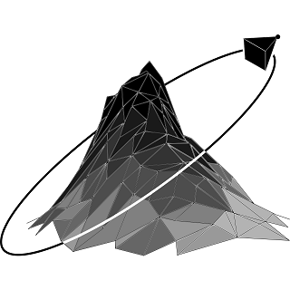

# SurvAid

Este é o repositório com o código completo do aplicativo multiplataforma SurvAid que foi desenvolvido como parte da pesquisa de doutorado de CD Viana, no Instituto de Geociências da Universidade de São Paulo. Trata-se de uma primeira tentativa de sistematizar as informações mais relevantes sobre o levantamento de imagens para a geração de modelos 3D de taludes usando Structure from Motion - Multi-view Stereo. Tem por objetivo auxiliar não especialista no Levantamento de campo 

# Prévia online
Uma versão totalmente funcional pode ser acessada [aqui](https://capimobile.web.app/)

